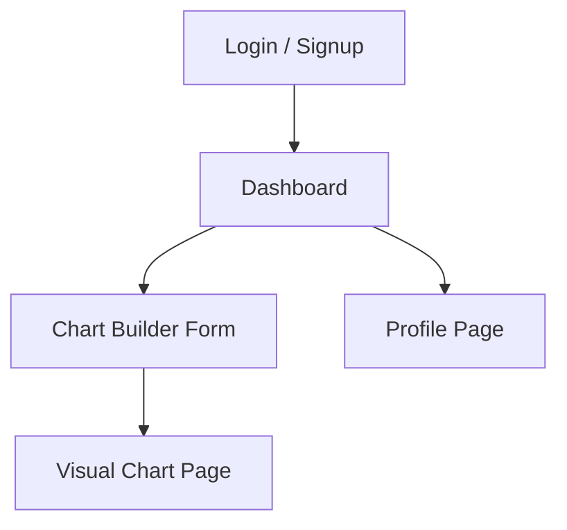

# 📊 InsightBoard – React + Tailwind Dashboard Builder

InsightBoard is a modern and dynamic dashboard generator built with **React** and **Tailwind CSS v3.4.17**. It allows users to:

- ✅ Sign up or log in
- 📥 Dynamically input bar and line chart data
- 📊 Preview generated charts using **Recharts**
- 🌗 Toggle between light and dark themes
- 🧭 Navigate across pages with a consistent sidebar

---

## 🚀 Live Preview
(https://insight-board-ivory.vercel.app/)

---

## 🖼️ Project Flow



> All pages (except Login) share a persistent **Sidebar layout** with navigation and theme toggle.

---

## 📁 Folder Structure

```
insightboard/
├── public/
├── src/
│   ├── components/
│   │   └── Layout.jsx          # Shared layout with sidebar + theme
│   ├── pages/
│   │   ├── Login.jsx
│   │   ├── Dashboard.jsx
│   │   ├── ChartBuilder.jsx
│   │   ├── VisualCharts.jsx
│   │   └── Profile.jsx
│   ├── App.js                  # Main route configuration
│   ├── index.js                # React root setup
│   ├── index.css               # Tailwind imports
│   ├── tailwind.config.js      # Tailwind setup
│   └── postcss.config.js
```

---

## 🧩 Tech Stack

| Feature       | Technology                    |
|---------------|-------------------------------|
| Framework     | React                         |
| Styling       | Tailwind CSS v3.4.17          |
| Charts        | Recharts                      |
| Routing       | React Router DOM              | 
| State         | React useState + localStorage |
| Icons         | React Icons                   |

---

## 💡 Features

- 🧾 Simple Login Input
- 📋 Chart Builder (Add/Remove dynamic inputs)
- 📊 Recharts for Line + Bar Charts
- 🎨 Light/Dark Mode (persists in localStorage)
- 🔀 Sidebar Navigation on All Pages
- 👤 Editable Profile Page

---

## 🛠️ Installation

```bash
# Clone the repo
$ git clone https://github.com/yourusername/insightboard.git
$ cd insightboard

# Install dependencies
$ npm install

# Run the dev server
$ npm run dev
```

---
## 📦 To-Do / Future Enhancements

- [ ] Auth integration (Firebase / Supabase)
- [ ] Backend data store (MongoDB / PostgreSQL)
- [ ] Export/Download chart as PNG or CSV
- [ ] Mobile responsiveness improvements
- [ ] User roles and permissions

---

## 🧑‍💻 Author

Made with ❤️ by **Srivathsan C. B.**

Connect with me:
- [GitHub](https://github.com/Srii1012)
- [LinkedIn](https://linkedin.com/in/srivathsan-c-b-75577b24a)

---

## 📄 License

This project is licensed under the MIT License.

---
This project was bootstrapped with [Create React App](https://github.com/facebook/create-react-app).

## Available Scripts

In the project directory, you can run:

### `npm start`

Runs the app in the development mode.\
Open [http://localhost:3000](http://localhost:3000) to view it in your browser.

The page will reload when you make changes.\
You may also see any lint errors in the console.

### `npm test`

Launches the test runner in the interactive watch mode.\
See the section about [running tests](https://facebook.github.io/create-react-app/docs/running-tests) for more information.

### `npm run build`

Builds the app for production to the `build` folder.\
It correctly bundles React in production mode and optimizes the build for the best performance.

The build is minified and the filenames include the hashes.\
Your app is ready to be deployed!

See the section about [deployment](https://facebook.github.io/create-react-app/docs/deployment) for more information.

### `npm run eject`

**Note: this is a one-way operation. Once you `eject`, you can't go back!**

If you aren't satisfied with the build tool and configuration choices, you can `eject` at any time. This command will remove the single build dependency from your project.

Instead, it will copy all the configuration files and the transitive dependencies (webpack, Babel, ESLint, etc) right into your project so you have full control over them. All of the commands except `eject` will still work, but they will point to the copied scripts so you can tweak them. At this point you're on your own.

You don't have to ever use `eject`. The curated feature set is suitable for small and middle deployments, and you shouldn't feel obligated to use this feature. However we understand that this tool wouldn't be useful if you couldn't customize it when you are ready for it.

## Learn More

You can learn more in the [Create React App documentation](https://facebook.github.io/create-react-app/docs/getting-started).

To learn React, check out the [React documentation](https://reactjs.org/).

### Code Splitting

This section has moved here: [https://facebook.github.io/create-react-app/docs/code-splitting](https://facebook.github.io/create-react-app/docs/code-splitting)

### Analyzing the Bundle Size

This section has moved here: [https://facebook.github.io/create-react-app/docs/analyzing-the-bundle-size](https://facebook.github.io/create-react-app/docs/analyzing-the-bundle-size)

### Making a Progressive Web App

This section has moved here: [https://facebook.github.io/create-react-app/docs/making-a-progressive-web-app](https://facebook.github.io/create-react-app/docs/making-a-progressive-web-app)

### Advanced Configuration

This section has moved here: [https://facebook.github.io/create-react-app/docs/advanced-configuration](https://facebook.github.io/create-react-app/docs/advanced-configuration)

### Deployment

This section has moved here: [https://facebook.github.io/create-react-app/docs/deployment](https://facebook.github.io/create-react-app/docs/deployment)

### `npm run build` fails to minify

This section has moved here: [https://facebook.github.io/create-react-app/docs/troubleshooting#npm-run-build-fails-to-minify](https://facebook.github.io/create-react-app/docs/troubleshooting#npm-run-build-fails-to-minify)
